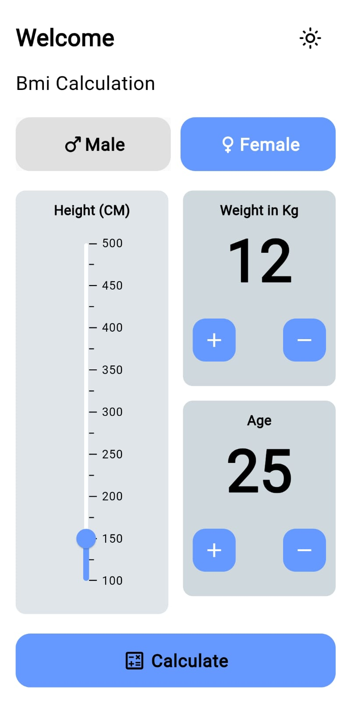
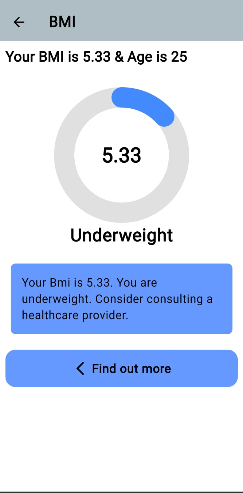
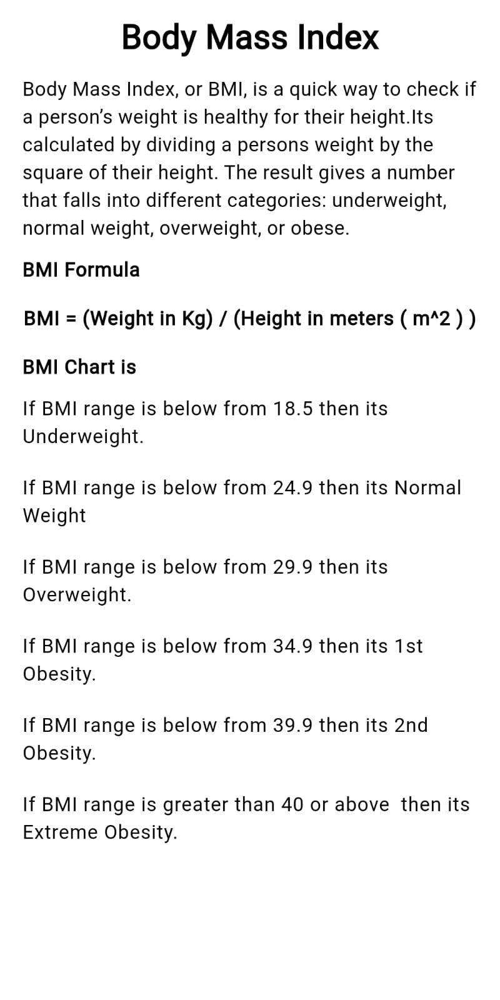
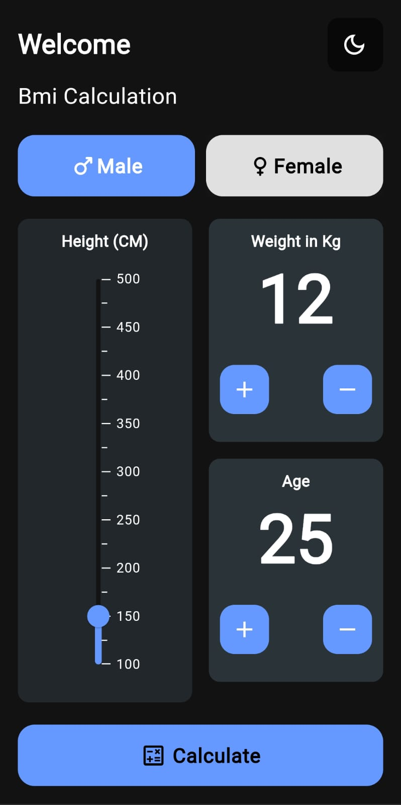
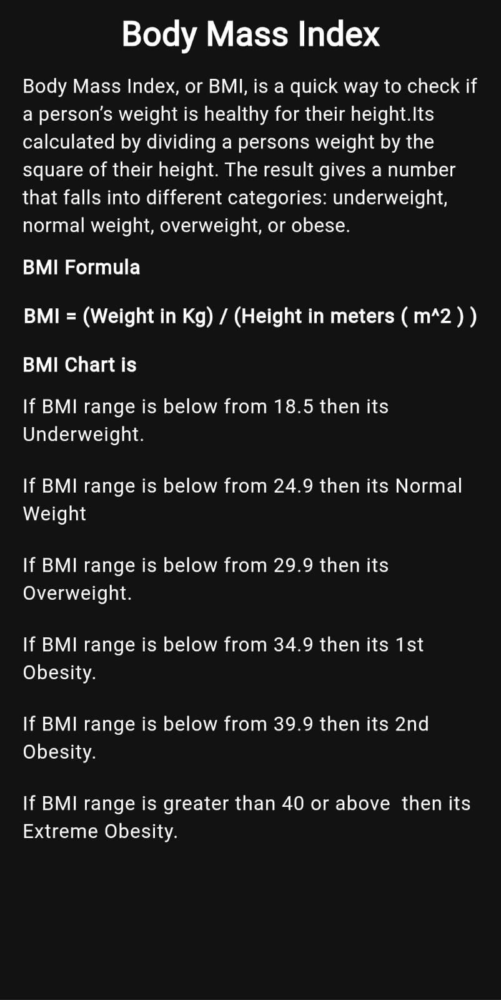

# BMI Calculator App
## A Flutter-based BMI Calculator application that helps users calculate their Body Mass Index (BMI) and understand their health category easily.

## ✨ Features
- Calculate BMI using height & weight
- Supports metric units (cm & kg)
- Instant BMI result
- Health category display
  (Underweight, Normal, Overweight, Obese)
- light & Dark mode
- Clean & simple UI

## 🛠️ Tech Stack
- Flutter
- Dart
- GetX for State Management

## ⚙️ Installation & Setup 
### Clone the repository
```
 git clone https://github.com/priyankatuli/bmi_calculator.git
```
### Install dependencies
```
   flutter pub get
```
### Run the app
```
   flutter run
```
### Build Apk
```
  flutter build apk --release
```
## BMI Categories
- Underweight: BMI < 18.5
- Normal weight: 18.5 – 24.9
- Overweight: 25 – 29.9
- Obese: BMI ≥ 30

## 📸 Screenshots

### 🌞 Light Mode
| Splash Screen | Home Screen | BMI Screen | BMI Details Screen                             |
|---------------|-------------|------------|------------------------------------------------|
|  |  |  |  |

---

### 🌙 Dark Mode
| Splash Screen | Home Screen | BMI Screen | BMI Details Screen                            |
|---------------|-------------|------------|-----------------------------------------------|
|  |  |  |  |
